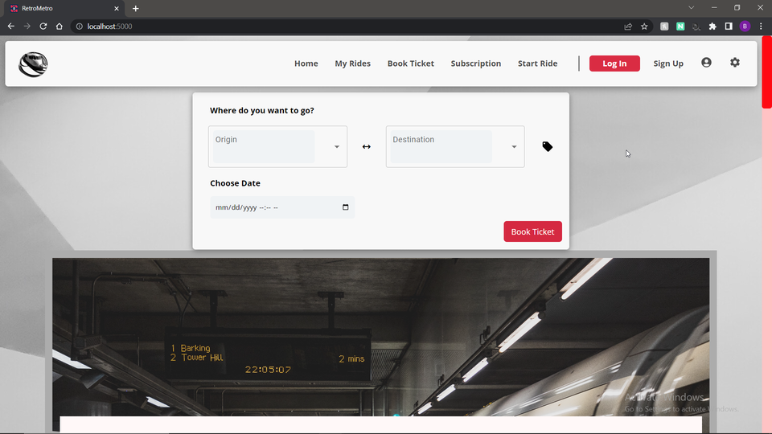
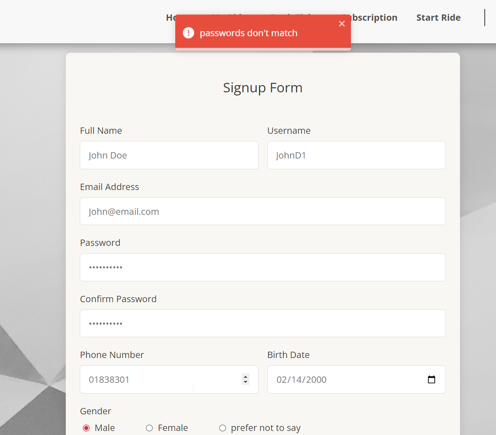
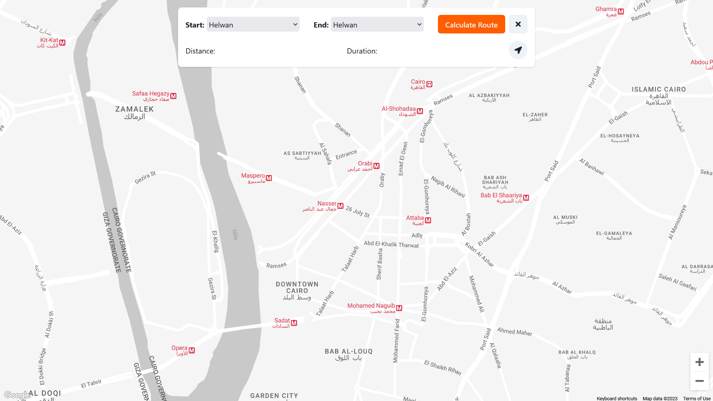
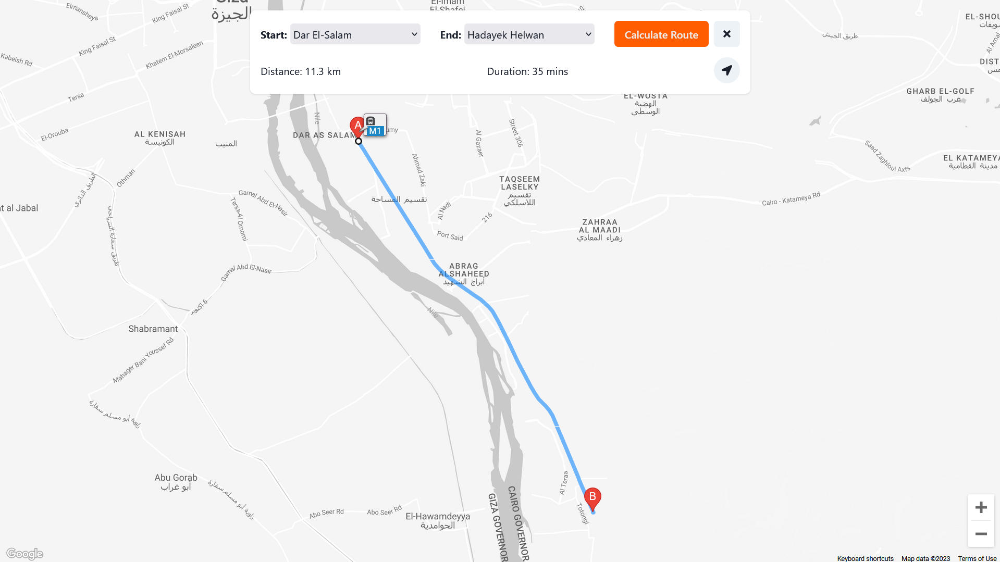
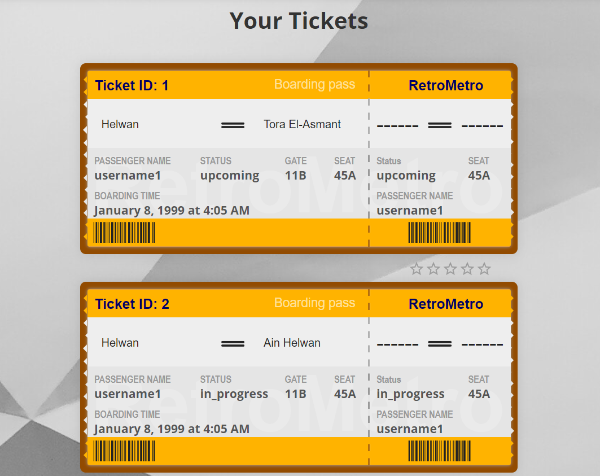
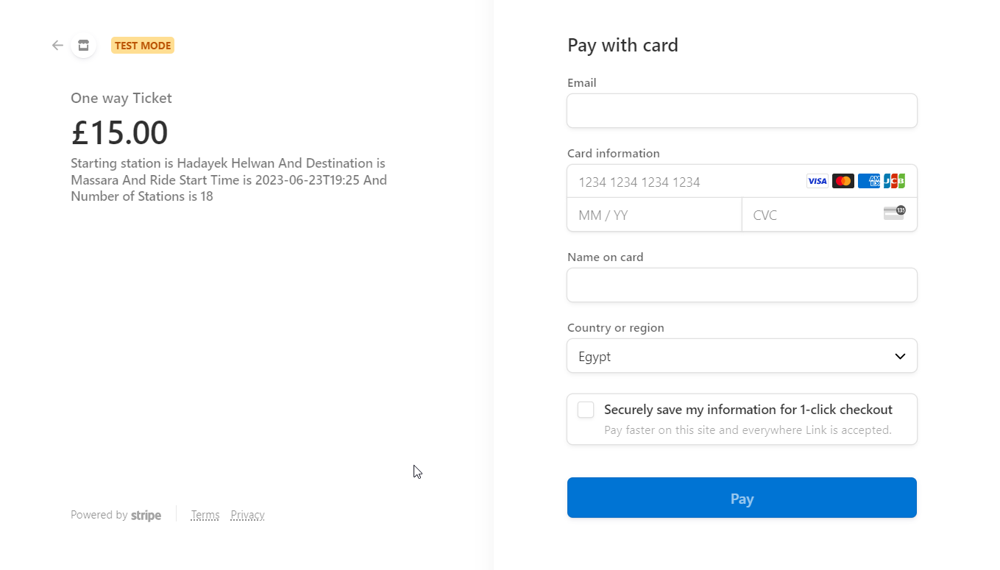
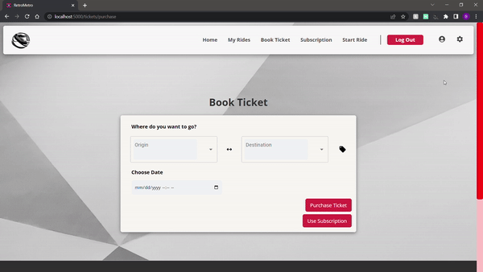
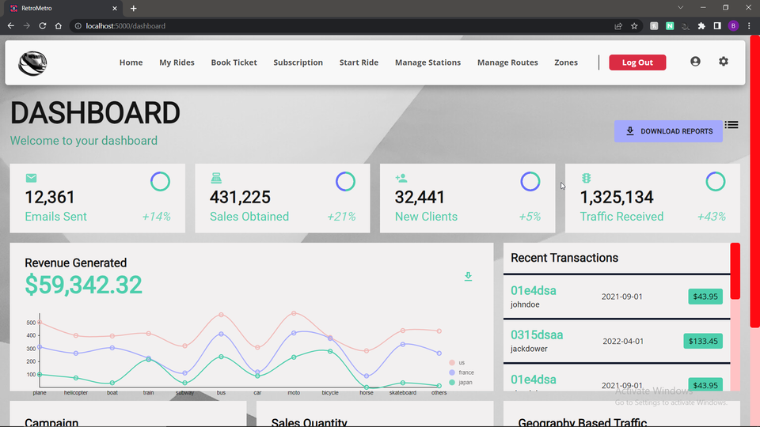
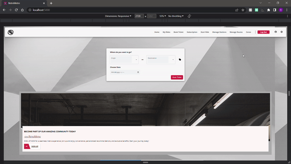

<html>
<h1>Cairo Metro System</h1>
   
   <h3></h3>
    <h2>
    Table of contents
    </h2>
    <h2>Demo</h2>
        <h4>You can watch a walkthrough of the website from <a href="https://drive.google.com/drive/folders/1G9J6oPhQiX0V36ZfZqRkj2C0ZpatRAyG" target="_blank">Here</a></h4>
    <h3> 
        <ul>
            <li>Project Title</li>
            <li>Demo</li>
            <li>Table of contents</li>
            <li>Description</li>
            <li>Usage</li>
            <li>List of Features</li>
            <li>Preview</li>
            <li>Contributers</li>
        </ul>
    </h3>
     
    <h2>Description</h2>
    <h4>Cairo Metro System is a web-based application that allows users to reserve and pay for metro tickets, view their upcoming rides, buy subscriptions, and more. Admins can manage the stations, routes, and zones. The application is built using the PERN stack, which consists of PostgreSQL, Express, React, and Node.js. PostgreSQL is an open-source object-relational database management system that supports both SQL and JSON querying. Express is a web framework for Node.js that provides features for routing, middleware, and handling HTTP requests and responses. React is a JavaScript library for building user interfaces. Node.js is a JavaScript runtime for developing server-side and networking applications. The application also uses Google Maps API for displaying maps and Stripe API for handling payments. The application is responsive with a silk design on all devices.
    </h4>
    <h2>Usage</h2>
    <h3><ol>
            <li>Clone this project</li>
            <li>Download Postgres and PGadmin</li>
            <li>Create a new databse in PGadmin then navigate to db.js and enter your database configuration</li>
            <li>Navigate to rerun_DB.sql and run the sql queries using PGadmin</li>
            <li>Open terminal in the project folder then run npm i command</li>
            <li>Clone the Front End files from this repo : <a href="https://github.com/youfiElwy/frontend-v3" target="_blank">Link</a></li>
            <li>Clone the Location Service files from this repo : <a href="https://github.com/AhmedHosny2/Google-Metro-Location-service" target="_blank">Link</a></li>
            <li>Open terminal in the front end project and location service folder then run npm i command</li>
            <li>Run npm start in all the projects and wait a min or two</li>
            <li>Enter in your browser http://localhost:5000/</li>
        </ol></h3>
    <h2>List of Features</h2>
        <ul>
            <li>Responsive Design</li>
            <li>Payments with Stripe API</li>
            <li>Google Maps API for displaying maps </li>
            <li>Forget password Feature</li>
            <li>Auto Complete Station names</li>
            <li>Passwords salted and hashed in the databse</li>
        </ul>
    <h2>Preview</h2>
     
    <h3>Sign Up page</h3>
     
    
     
    <h3>Map</h3>
     
    
     
     
    
     
    <h3>Tickets</h3>
     
    
     
    <h3>Stripe Payment</h3>
     
    
     
    <h3>Auto Complete Stations and check price</h3>
     
    
     
    <h3>Admin Dashboard</h3>
     
    
     
    <h3>Responsivness</h3>
     
    
     
    <h2>Contributers</h2>
        <ul>
            <li>Ahmed Osama <a href="https://github.com/AhmedOsamaAli" target="_blank">Github</a> <a href="https://www.linkedin.com/in/ahmedosamadiab/" target="_blank">Linkedin</a></li>
            <li>Ahmed Yehia <a href="https://github.com/AhmedHosny2" target="_blank">Github</a> <a href="https://www.linkedin.com/in/ahmed-yehia-155629206/" target="_blank">Linkedin</a></li>
            <li>Bahy Mohamed <a href="https://github.com/bahylol" target="_blank">Github</a> <a href="https://www.linkedin.com/in/bahy-salama/" target="_blank">Linkedin</a></li>
            <li>Youssef Elwy <a href="https://github.com/youfiElwy" target="_blank">Github</a> <a href="https://www.linkedin.com/in/youssef-elwy-427682268/" target="_blank">Linkedin</a></li>
        </ul>
</html>
